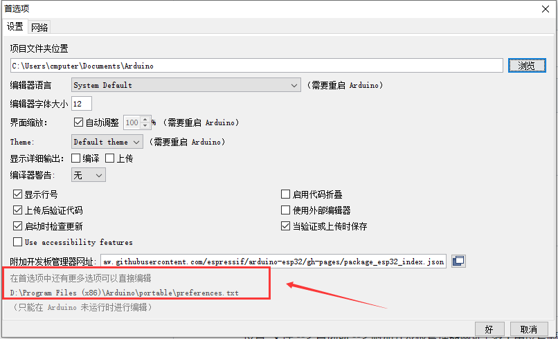
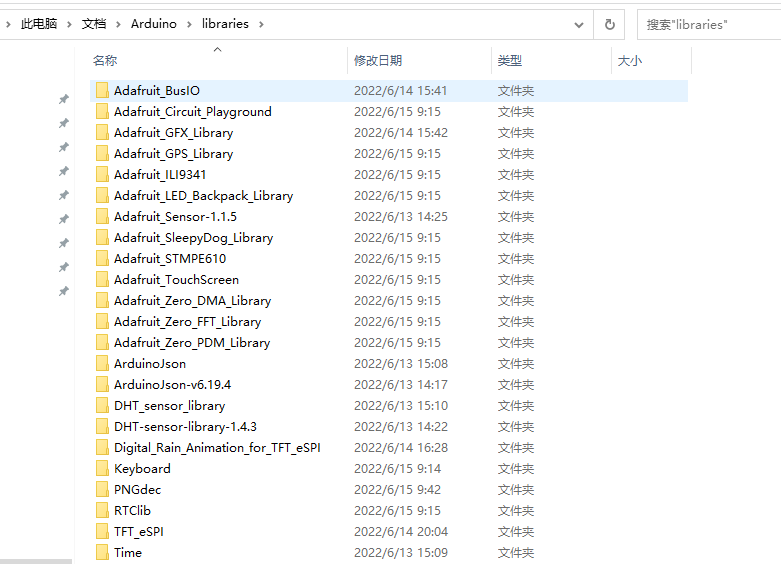

# Arduino 开发环境搭建 {ignore}

[toc]

## 安装 Arduino 

官网地址: https://www.arduino.cc/en/software

## 设置 Support Soc 表格

设置: 文件 --> 首选项 --> 附加开发板管理器网址 ( 多个用逗号隔开, github使用 [加速地址](https://hub.0z.gs) ,  仓库 [Release 里面有最新表格地址](https://hub.0z.gs/espressif/arduino-esp32/releases) )

```text
稳定版：
https://raw.githubusercontent.com/espressif/arduino-esp32/gh-pages/package_esp32_index.json

开发版：
https://raw.githubusercontent.com/espressif/arduino-esp32/gh-pages/package_esp32_dev_index.json
```


## 安装扩展插件 

入口:  工具 --> 开发板: "Arduino Uno" --> 开发板管理器 --> 搜索"esp32" --> 搜索结果里面选择版本安装 

下载安装包位于: %arduino%/staging/packages (prefereces.txt 目录下)

安装好的库为静态库, 源码在github上:  https://hub.0z.gs/espressif/arduino-esp32

注：第三方开发板均在 preferebces.txt 同目录下 ( 文件--> 首选项 , 在Arduino安装目录下新建一个 portable 目录 即可修改到安装目录下)：



注：开发库在我的文档 Arduino/libraries/ 目录下，比如 TFT_eSPI：



## 合宙ESP32C3板子支持 Serial.print 打印日志: 

- 重要提示：合宙板子上面有 CH343 的 (经典款) 才需要修改，没有的 (新款) 不需要
- 在合宙经典版的 ESP32C3 开发板上面会贴有 CH343 芯片，而这个芯片会导致使用 HardwareSerial 打印日志无法正常工作（esp32c3芯片内部已经实现了串口功能，所以再用 ch343 串口芯片数据转一次就不正确了），需要将 Serial 定义改成 HWCDC 以后直接针脚输出，再经由 ch343 串口芯片就正常工作了 

```C++
// ./packages/esp32/hardware/esp32/2.0.3-RC1/cores/esp32/HWCDC.h 
extern HWCDC Serial;
// 修改为 
#if CONFIG_IDF_TARGET_ESP32C3
extern HWCDC HWCDCSerial;
#else
extern HWCDC Serial;
#endif // CONFIG_IDF_TARGET_ESP32C3 

// ./packages/esp32/hardware/esp32/2.0.3-RC1/cores/esp32/HWCDC.cpp
HWCDC Serial;
// 修改为 
#if CONFIG_IDF_TARGET_ESP32C3
HWCDC HWCDCSerial;
#else
HWCDC Serial;
#endif  // CONFIG_IDF_TARGET_ESP32C3 

// ./packages/esp32/hardware/esp32/2.0.3-RC1/cores/esp32/HardwareSerial.h
extern HardwareSerial Serial0;
// 后面加入: 
#if CONFIG_IDF_TARGET_ESP32C3
extern HardwareSerial Serial;
#endif  // CONFIG_IDF_TARGET_ESP32C3 

// ./packages/esp32/hardware/esp32/2.0.3-RC1/cores/esp32/HardwareSerial.cpp 
HardwareSerial Serial0(0);
// 后面加入: 
#if CONFIG_IDF_TARGET_ESP32C3
HardwareSerial Serial(0);
#endif  // CONFIG_IDF_TARGET_ESP32C3 

// 注意: sdk 中 Serial1 使用RX 18, TX 19, 与合宙LUATOS不同 
```

## 出现 Arduino 下载程序以后无限重启问题解决 

- 这种情况一般是 bootloader 引导的问题，而 bootloader 相关东西太多 
- 需要先安装 idf 编译器，然后拉取安装目录下简单的 example 来编译 (可以使用Hello World例子)
- 一般不建议为了升级而替换，有些功能可能会出现问题，比如：WiFiClient 调用 available 就不可用 

注意： idf 的 CONFIG_FREERTOS_HZ 值 默认是 100, 而在 Arduino 中默认是 1000, 所以要把编译配置 sdkconfig 里的 CONFIG_FREERTOS_HZ 改成 1000 ，不然在 Arduino 调用 delay 函数是原来的 10 倍时间 

编译完以后，替换 booloader.bin 

```TXT
%pro%/build/bootloader/bootloader.bin  

替换 

%Arduino%/portable/packages/esp32/hardware/esp32/2.0.3(根据自己版本来)/tools/sdk/esp32c3/bin/bootloader_dio_80m.bin
```

替换系统初始化库 

```TXT
%Arduino%/portable/packages/esp32/hardware/esp32/2.0.3(根据自己版本来)/tools/sdk/esp32c3/qspi_qspi/*.a 

这里面所有的 *.a、sections.ld文件 
在刚才的编译 (%pro%/build) 目录下搜索对应文件替换  
```

替换支持库 

```TXT
%Arduino%/portable/packages/esp32/hardware/esp32/2.0.3(根据自己版本来)/tools/sdk/esp32c3/lib/*.a 

由于 *.a 文件太多，直接在编译目录  (%pro%/build)  搜索 *.a ,一股脑复制过去就好了(如果有重复的，丢弃build/bootloader/esp-idf下面的文件)，但是编译出来的还缺几个库，需要从原来的lib中复制几个过去 (比如：libbt.a、libbutton.a.... 20来个)  
```
