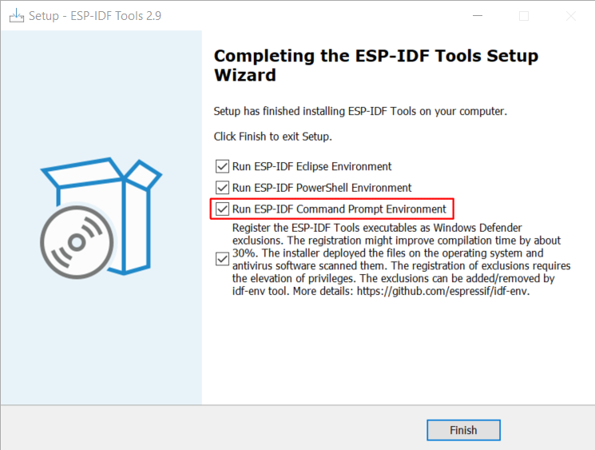

# ESP32-C3 快速入门 {ignore}

[toc]

## 概述

ESP32-C3 SoC 芯片采用 40 nm 工艺制成，支持以下功能：
- 2.4 GHz Wi-Fi
- 低功耗蓝牙
- 高性能 32 位 RISC-V 单核处理器
- 多种外设
- 内置安全硬件

## 合宙接口定义


|序号 |符号   |含义(复用功能)                       |序号 |符号  |含义(复用功能)                |
|-----|------|-------------------------------------|-----|------|---------------------------- |
|01   |GND    |接地                                |17   |GND   |接地                         |
|02   |IO0*   |GPIO0  输入/输出,高阻(UART1_TX/ADC_0)|18   |3.3V  |芯片电源,3.3V                 |
|03   |IO01*  |GPIO01 输入/输出,高阻(UART1_RX/ADC_1)|19   |IO02* |GPIO02 输入/输出,高阻(PWM02/SPI0_CK/ADC_2)|
|04   |IO12*  |GPIO12 输入/输出,高阻(SPIHD/D4 LED)  |20   |IO03^  |GPIO03 输入/输出,高阻(SPI0_MOSI/ADC_3)|
|05   |IO18*  |GPIO18 输入/输出,高阻(USB_D-)       |21   |IO10* |GPIO10 输入/输出,高阻(PWM03/SPI0_MISO)|
|06   |IO19*  |GPIO19 输入/输出,高阻(USB_D+)       |22   |IO06* |GPIO06 输入/输出,高阻(PWM01)  |
|07   |GND    |接地                                |23   |IO07* |GPIO07 输入/输出,高阻(SPI0_CS)|
|08   |U0_TX* |GPIO21 输入/输出,高阻(UART0_TX)    |24   |IO11* |GPIO11 输入/输出,高阻(VDD_SPI) |
|09   |U0_RX* |GPIO20 输入/输出,高阻(UART0_RX)    |25   |GND   |接地                          |
|10   |IO13*  |GPIO13 输入/输出,高阻(D5 LED)      |26   |3.3V  |芯片电源，3.3V                |
|11   |NC     |悬空                                |27   |IO05^ |GPIO05 输入/输出,高阻(I2C_SCL/ADC_5)|
|12   |RESET^ |芯片复位                            |28   |IO04^ |GPIO04 输入/输出,高阻(I2C_SDA/ADC_4)|
|13   |3.3V   |芯片电源,3.3V                       |29   |IO08* |GPIO08 输入/输出(PWM04)|
|14   |GND    |接地                                |30   |BOOT* |GPIO09 输入(BOOTMODE)         |
|15   |PWB    |芯片3.3V供电控制,高电平有效,不用可悬空|31   |5V    |5V电源接口，与USB的VUSBS相连  |
|16   |5V     |5V电源接口,与USB的VUSBS相连          |32   |GND   |接地                         |

注：带星号电源域为 VDD3P3_CPU, 带^电源域为 VDD3P3_RTC


|序号 |符号   |含义                                 |序号 |符号  |含义                         |
|-----|------|-------------------------------------|-----|------|---------------------------- |
|01   |      |          |17   |GND   |接地          |
|02   |      |          |18   |3.3V  |电源正 3.3V   |
|03   |      |          |19   |SCK   |              |
|04   |      |          |20   |SDA   |              |
|05   |      |          |21   |RES   |              |
|06   |      |          |22   |DC    |              |
|07   |      |          |23   |CS    |              |
|08   |      |          |24   |BL    |              |
|09   |      |          |25   |GND   |电源地        |
|10   |PB_11 |          |26   |3.3V  |电源正 3.3V   |
|11   |      |          |27   |PA_1  |              |
|12   |      |          |28   |PA_4  |              |
|13   |      |          |29   |PA_7  |              |
|14   |      |          |30   |PA_0  |              |
|15   |      |          |3    |      |              |
|16   |      |          |32   |5V    |电源正 5V     |

## 准备工作

硬件：
- 一款 ESP32-C3 开发板
- USB 数据线 (A 转 Micro-B)
- 电脑（Windows、Linux 或 Mac OS）


## 编译LuatOS系统（推荐Windows, 直接安装4.4版离线包即可）

Linux 下一些工具最低版本要求: 
- python 3.7 
- bash 4.4 
- CMake 3.5

### 1.1 Windows 安装工具链（编译环境）

Windows ESP-IDF 离线工具安装器： [https://dl.espressif.com/dl/esp-idf/?idf=4.4](https://dl.espressif.com/dl/esp-idf/?idf=4.4)



### 1.2 Linux 获取 ESP-IDF 4.4 (编译工具设置)

#### a. 首先安装依赖库：
```shell
# Ubuntu / Debian
$ sudo apt-get install git wget flex bison gperf python3 python3-pip python3-setuptools cmake ninja-build ccache libffi-dev libssl-dev dfu-util libusb-1.0-0

# Centos7 / 8
$ sudo yum -y update && sudo yum install git wget flex bison gperf python3 python3-pip python3-setuptools cmake ninja-build ccache dfu-util libusbx

# Arch
$ sudo pacman -S --needed gcc git make flex bison gperf python-pip cmake ninja ccache dfu-util libusb
```

注： ESP-IDF 需要 CMake3.5 或以上版本 


#### b. 下载乐鑫提供的软件库文件 [ESP-IDF 克隆仓库](https://git.jq99.top:9999/lgj/esp-idf) 或者 [ESP-IDF 官方仓库](https://github.com/espressif/esp-idf)
注: 加速代理地址 https://ghproxy.com/ 

切换到分支 release/v4.4
```shell
$ git branch v4.4
$ git checkout v4.4
```

如果不是从github下载仓库，需要运行脚本：
```shell
$ ./tools/set-submodules-to-github.sh
```

接着更新子模块：
```shell
$ git submodule update --init --recursive
```

#### c. 然后使用命令行安装(esp32c3)：

Windows Shell 
```dos
; bat
C:\> install.bat esp32c3

; powershell 
C:\> ./install.ps1 esp32c3
```

Linux Shell
```shell
$ ./install.sh esp32c3
```

设置环境变量(idf.py 加入环境变量):
```shell
$ . ./export.sh
```


### 2 拉取 LuatOS-ESP32 进行编译 

esp32i硬件部分代码下载 [镜像仓库](https://git.jq99.top:9999/lgj/LuatOS-ESP32.git)  或者 [官方仓库](https://github.com/dreamcmi/LuatOS-ESP32.git) 
LuatOS系统源码下载同一目录下 [镜像仓库](https://git.jq99.top:9999/lgj/LuatOS.git) 或者 [官方仓库](https://github.com/openLuat/LuatOS.git)

```shell
$ git clone https://gitee.com/dreamcmi/LuatOS-ESP32.git
$ git clone https://gitee.com/openLuat/LuatOS.git
```

进入 LuatOS-ESP32 仓库运行命令：
```shell
$ idf.py set-target esp32c3
$ idf.py build
```

编译完文件在  build/luatos_esp32.bin 


### 3.1 直接命令行刷机

```shell
$ sudo idf.py -p com3 flash
```

### 3.2 生成soc文件 (用luatools刷机)

进入 LuatOS-ESP32/tools 目录：
```shell
$ sudo pip install -r requirements.txt
$ python esp32v3.py -t esp32c3 -p
```
