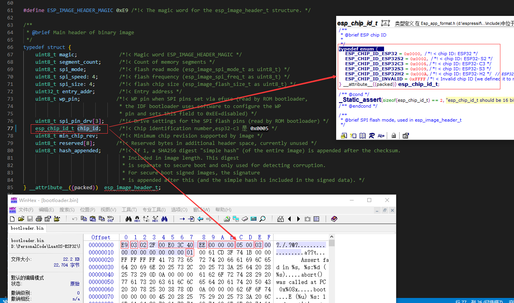
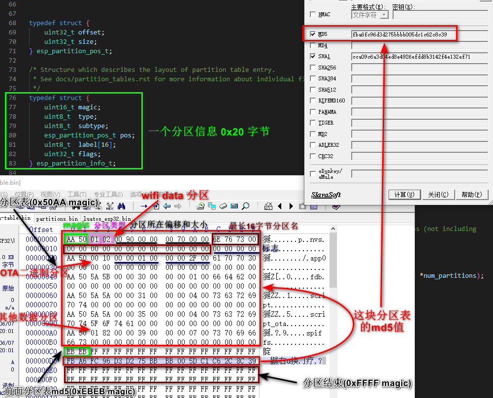
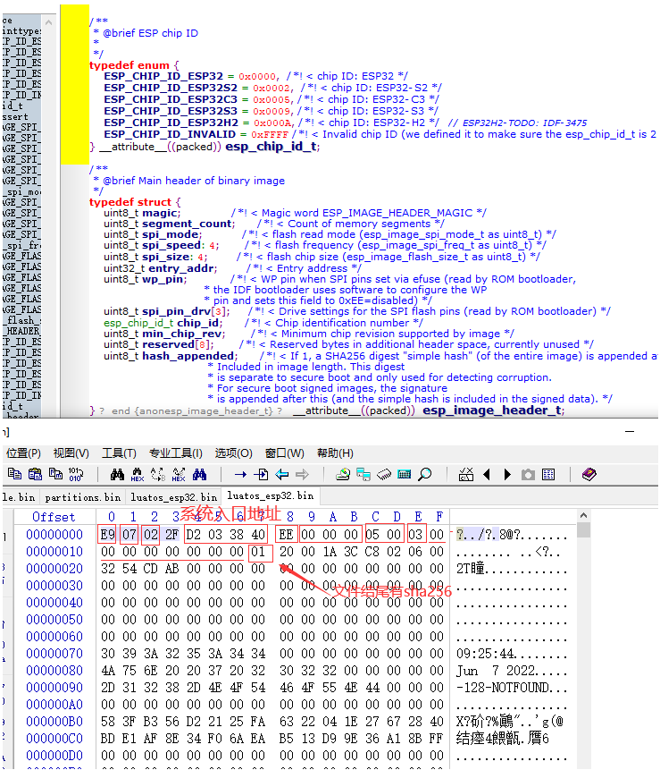

# LuatOS-ESP32 源码分析 {ignore}

[toc]

## bootloader 分析

bootloader 代码不在 LuatOS 中,在 idf 工具链当中, github 地址: https://github.com/espressif/esp-idf/tree/master/components

在 LuatOS-ESP 编译中,使用到如下文件:
```list
$(LuatOS-ESP32)/build/bootloader/project_elf_src_esp32c3.c  {空文件}
$(IDF_DIR)/components/hal/wdt_hal_iram.c
$(IDF_DIR)/components/hal/mpu_hal.c
$(IDF_DIR)/components/hal/cpu_hal.c
$(IDF_DIR)/components/soc/lldesc.c
$(IDF_DIR)/components/soc/soc_include_legacy_warn.c
$(IDF_DIR)/components/soc/esp32c3/adc_periph.c
$(IDF_DIR)/components/soc/esp32c3/dedic_gpio_periph.c
$(IDF_DIR)/components/soc/esp32c3/gdma_periph.c
$(IDF_DIR)/components/soc/esp32c3/gpio_periph.c
$(IDF_DIR)/components/soc/esp32c3/interrupts.c
$(IDF_DIR)/components/soc/esp32c3/spi_periph.c
$(IDF_DIR)/components/soc/esp32c3/ledc_periph.c
$(IDF_DIR)/components/soc/esp32c3/rmt_periph.c
$(IDF_DIR)/components/soc/esp32c3/sigmadelta_periph.c
$(IDF_DIR)/components/soc/esp32c3/i2s_periph.c
$(IDF_DIR)/components/soc/esp32c3/i2c_periph.c
$(IDF_DIR)/components/soc/esp32c3/uart_periph.c
$(IDF_DIR)/components/soc/esp32c3/timer_periph.c
$(IDF_DIR)/components/bootloader/subproject/components/micro-ecc/uECC_verify_antifault.c
$(IDF_DIR)/components/spi_flash/esp32c3/spi_flash_rom_patch.c
$(IDF_DIR)/components/bootloader_support/src/bootloader_common.c
$(IDF_DIR)/components/bootloader_support/src/bootloader_common_loader.c
$(IDF_DIR)/components/bootloader_support/src/bootloader_clock_init.c
$(IDF_DIR)/components/bootloader_support/src/bootloader_flash.c
$(IDF_DIR)/components/bootloader_support/src/bootloader_mem.c
$(IDF_DIR)/components/bootloader_support/src/bootloader_random.c
$(IDF_DIR)/components/bootloader_support/src/bootloader_random_esp32c3.c
$(IDF_DIR)/components/bootloader_support/src/bootloader_utility.c
$(IDF_DIR)/components/bootloader_support/src/esp_image_format.c
$(IDF_DIR)/components/bootloader_support/src/flash_encrypt.c
$(IDF_DIR)/components/bootloader_support/src/secure_boot.c
$(IDF_DIR)/components/bootloader_support/src/flash_partitions.c
$(IDF_DIR)/components/bootloader_support/src/flash_qio_mode.c
$(IDF_DIR)/components/bootloader_support/src/bootloader_flash_config_esp32c3.c
$(IDF_DIR)/components/bootloader_support/src/bootloader_efuse_esp32c3.c
$(IDF_DIR)/components/bootloader_support/src/bootloader_init.c
$(IDF_DIR)/components/bootloader_support/src/bootloader_clock_loader.c
$(IDF_DIR)/components/bootloader_support/src/bootloader_console.c
$(IDF_DIR)/components/bootloader_support/src/bootloader_console_loader.c
$(IDF_DIR)/components/bootloader_support/src/bootloader_panic.c
$(IDF_DIR)/components/bootloader_support/src/esp32c3/bootloader_sha.c
$(IDF_DIR)/components/bootloader_support/src/esp32c3/bootloader_soc.c
$(IDF_DIR)/components/bootloader_support/src/esp32c3/bootloader_esp32c3.c
$(IDF_DIR)/components/efuse/esp32c3/esp_efuse_table.c
$(IDF_DIR)/components/efuse/esp32c3/esp_efuse_fields.c
$(IDF_DIR)/components/efuse/esp32c3/esp_efuse_rtc_calib.c
$(IDF_DIR)/components/efuse/esp32c3/esp_efuse_utility.c
$(IDF_DIR)/components/efuse/src/esp_efuse_api.c
$(IDF_DIR)/components/efuse/src/esp_efuse_fields.c
$(IDF_DIR)/components/efuse/src/esp_efuse_utility.c
$(IDF_DIR)/components/efuse/src/esp_efuse_api_key_esp32xx.c
$(IDF_DIR)/components/esp_system/esp_err.c
$(IDF_DIR)/components/esp_hw_support/compare_set.c
$(IDF_DIR)/components/esp_hw_support/cpu_util.c
$(IDF_DIR)/components/esp_hw_support/port/esp32c3/cpu_util_esp32c3.c
$(IDF_DIR)/components/esp_hw_support/port/esp32c3/rtc_clk_init.c
$(IDF_DIR)/components/esp_hw_support/port/esp32c3/rtc_clk.c
$(IDF_DIR)/components/esp_hw_support/port/esp32c3/rtc_init.c
$(IDF_DIR)/components/esp_hw_support/port/esp32c3/rtc_pm.c
$(IDF_DIR)/components/esp_hw_support/port/esp32c3/rtc_sleep.c
$(IDF_DIR)/components/esp_hw_support/port/esp32c3/rtc_time.c
$(IDF_DIR)/components/esp_hw_support/port/esp32c3/chip_info.c
$(IDF_DIR)/components/esp_common/src/esp_err_to_name.c
$(IDF_DIR)/components/esp_rom/patches/esp_rom_crc.c
$(IDF_DIR)/components/esp_rom/patches/esp_rom_sys.c
$(IDF_DIR)/components/esp_rom/patches/esp_rom_uart.c
$(IDF_DIR)/components/esp_rom/patches/esp_rom_tjpgd.c
$(IDF_DIR)/components/log/log.c
$(IDF_DIR)/components/log/log_buffers.c
$(IDF_DIR)/components/log/log_noos.c
$(IDF_DIR)/components/bootloader/subproject/main/bootloader_start.c       { 入口文件 }
```

1. 在SOC复位以后, CPU 立即开始执行, 执行所有初始化操作. 复位向量代码位于 ESP32-C3 芯片掩膜 ROM 处, 且不能被修改。放在 flash 的 0x0 偏移地址 (注: 旧版使用 0x1000 偏移, 使用宏 CONFIG_BOOTLOADER_OFFSET_IN_FLASH 配置) 处的二进制就是二级引导程序（由一级 ROM 中的bootloader进行加载到 RAM 中），代码在 idf 工具包里面, 详情见 [官方文档](https://docs.espressif.com/projects/esp-idf/zh_CN/latest/esp32c3/api-guides/startup.html)。

2. 二级 bootloader 整个流程很好理解(入口: bootloader_start.c), 启动过程是单核运行（esp32-c3就是单核处理器）, 二级bootloader 从Flash中加载分区表 (Flash的 0x8000 偏移地址, CONFIG_PARTITION_TABLE_OFFSET 宏定义， 最大长度 0xC00 ) 和主程序镜像到内存, 主程序中包含了 RAM 段和通过 Flash 高速缓存映射的只读段

3. 主程序开始运行, 这时第二个 CPU 和 RTOS 的调度器可以开始运行


二级 bootloader 启动代码如下 (components/bootloader/subproject/main/bootloader_start.c): 

```C++
void __attribute__((noreturn)) call_start_cpu0(void)
{
    // 源码并未实现,使用者可以根据自己需要编写这个函数(一般用于校验bootloader自身是否完整) 
    if (bootloader_before_init) {
        bootloader_before_init();
    }

    // 各种硬件初始化.如果初始化失败,则重启设备 
    // bootloader_init 先初始化hardware(ULP协处理器/BIAS寄存器)、初始化看门狗、设置自动喂养看门狗
    // 初始化内存、bss段内存清零、重置MMU、配置时钟频率
    // bootloader_console_init() 初始化控制台，此时可以使用 ESP_LOGI(esp_rom_printf) 宏打日志了(打印到串口 USB-UART 或者 USB-CDC ) 、bootloader_print_banner() 日志输出 bootloader的编译信息 
    // 读取设备id放入 g_rom_flashchip.device_id 
    // 初始化Flash (xmc) ， 初始化 esp_rom_spiflash_chip_t 结构，其中大小 g_rom_flashchip.chip_size 
    // 读取 bootloader 头部信息到 bootloader_image_hdr 
    // 编译宏 CONFIG_IDF_FIRMWARE_CHIP_ID 与 bootloader_image_hdr->chip_id 是否匹配, 读取 fpga 芯片版本与 bootloader_image_hdr->min_chip_rev 是否匹配 
    // 初始化 SPI 闪存引脚 (编译配置文件 CONFIG_SPI_FLASH_ROM_DRIVER_PATCH ) 
    // 检测是否触发看门狗复位事件，若没有则可以禁用看门狗了 
    // 启用随机数生成器 
    if (bootloader_init() != ESP_OK) {
        bootloader_reset();
    }

    // 未实现,可以根据自己需要编写初始化完成需要做的事情(用户升级系统或者解密) 
    if (bootloader_after_init) {
        bootloader_after_init();
    }

#ifdef CONFIG_BOOTLOADER_SKIP_VALIDATE_IN_DEEP_SLEEP
    // 深度睡眠唤醒可以省略后面选分区，加载工作 
    bootloader_utility_load_boot_image_from_deep_sleep();
    // 深度唤醒不成功，会继续下面启动流程 
#endif

    // 选择一个启动分区: 
    // 使用 bootloader_mmap 将 0x8000 的分区表映射到内存中（分区表是一个esp_partition_info_t 数组, sizeof(esp_partition_info_t)==0x20 ） 
    // select_partition_number 返回启动分区索引，bs 各类型分区信息 
    bootloader_state_t bs = {0};
    int boot_index = select_partition_number(&bs);
    if (boot_index == INVALID_INDEX) {
        bootloader_reset();
    }

    // 加载对应的分区,并跳转过去运行 
    // 找到所有分区，然后从 esp_partition_info_t->type==PART_TYPE_APP 和  esp_partition_info_t->subtype==PART_SUBTYPE_FACTORY/PART_SUBTYPE_TEST(根据启动模式) 判断启动分区 
    // load_image -> unpack_load_app -> set_cache_and_start_app -> 调用 esp_image_metadata_t->image.entry_addr 启动 
    bootloader_utility_load_boot_image(&bs, boot_index);
}
```

bootloader (build\bootloader\bootloader.bin) 格式, 前 0x16 字节是一个 esp_image_header_t 结构:




分区表 (build\partition_table\partition-table.bin) 格式(最大分区个数为 96个， 0xc00字节)：



系统分区 (build\luatos_esp32.bin) 格式 



