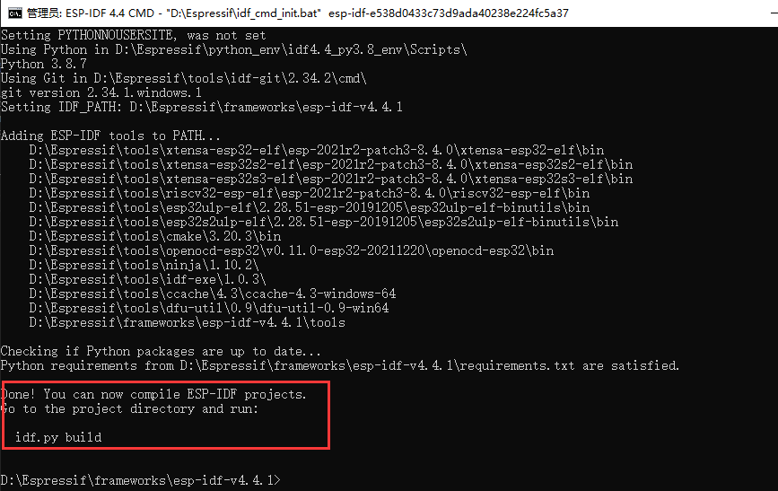

# 创建新工程 {ignore}

[toc]


## 从Hello World开始

1. 在 Espressif 安装目录下有示例程序 ( %Espressif%/frameworks/esp-idf-v4.4.1/examples )，如果未找到直接去 github下载 [https://github.com/espressif/esp-idf](https://hub.0z.gs/espressif/esp-idf) 在 examples/get-started 目录下 有个 hello_world 文件夹，复制一份出来 

2. 打开 idf 编译环境，正常应该提示如下：
    windows 环境： 
    
    Linux 环境：
    

3. 转换到改成复制的Hello World所在目录，然后输入命令
   ```shell
   $ cd %xxxx%/hello_world  # 根据自己复制的目录进行设置 

   $ idf.py set-target esp32c3  # 设置编译对象为esp32-c3芯片 

   $ idf.py menuconfig     # 修改配置信息(可以默认),手动修改在工程目录下的 sdkconfig 文件 

   $ idf.py build  # 开始进行编译 
   ```
   

4. 输入固件
   注意：esp32-c3 如果没有ch343芯片刷固件，需要先按住 rst+boot 按钮，然后松开rst，等待一会儿再松开boot 使esp32-c3芯片进入下载模式，然后输入idf.py -p port flash 命令才能正常刷机，等待提示刷机完成，按rest重启芯片后进入正常启动流程（不按rest重启，会一直停留在刷机模式） 
   

   在不在刷机模式，可以使用串口打印日志看到（频率115200）
   

## 从零开始建工程 

主要编写如下文件即可（主要还是学习cmake语法）:
```cmake
%project%\CMakeLists.txt
%project%\Makefile
%project%\main\CMakeLists.txt
```
